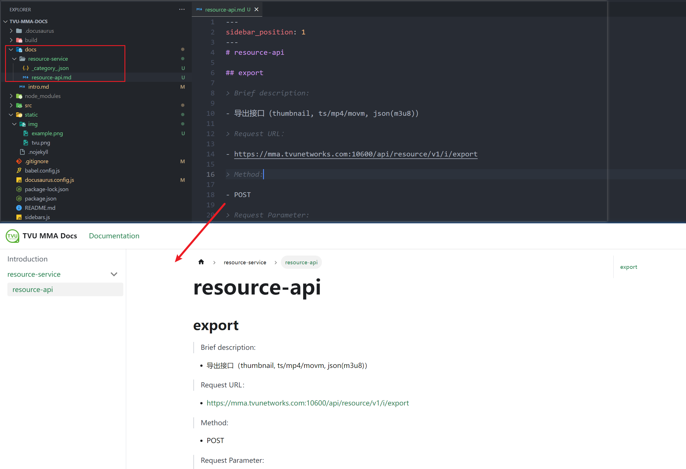
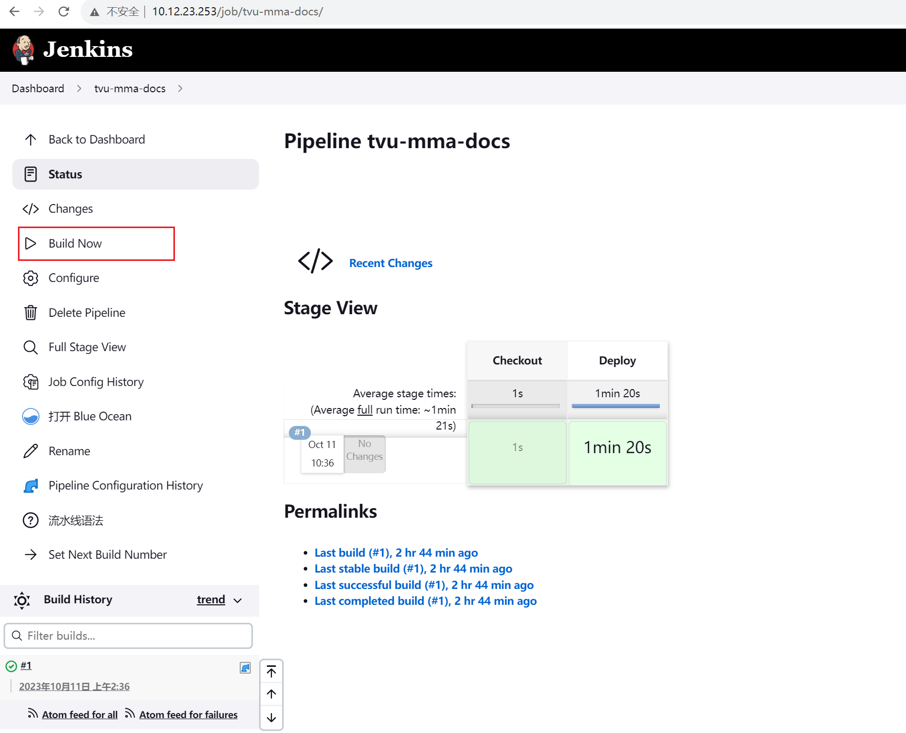

# Introduction

Some of TVU MMA's project documents are presented here.

## Developer Tutorials

You can write your own project documentation by following this process.

### New Project Categories and Project Documents

- SVN Checkout: http://10.12.20.126/svn/webservice/trunk/service/goservice/src/tvu-mma-docs
- Then go to the `docs` directory in the `tvu-mma-docs` project directory and create your own project folder: `cd tvu-mma-docs/docs`.
- Create a project directory and enter:
  ```powershell
  mkdir resource-service
  cd resource-service
  ```
- Creating a configuration file `_category_.json`:
  ```json
  {
    "label": "resource documents",  # 类目标题  
    "position": 2,  # 类目位置
    "link": {
      "type": "generated-index",
      "description": "The following are all resource-service related documents.."
    }
  }
  ```
- Creating a project document, you can refer to the [official documentation](https://tutorial.docusaurus.io/docs/tutorial-basics/create-a-document)
  

### Submit For Deployment
- SVN Commit
- Jenkins Build: http://10.12.23.253/job/tvu-mma-docs/
  

### View Results
- Open In Browser: https://rabbitdream.github.io/tvudocs/docs/intro